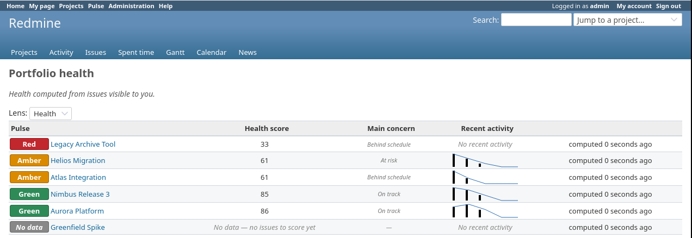
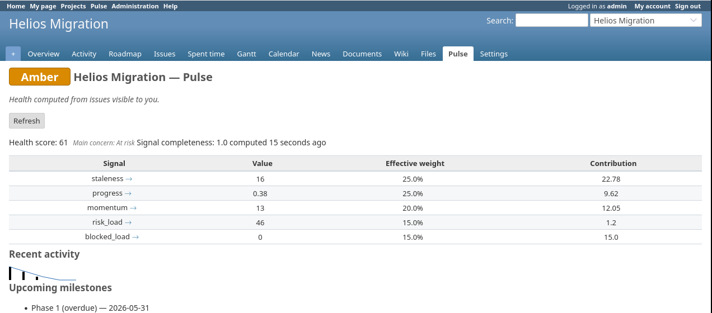
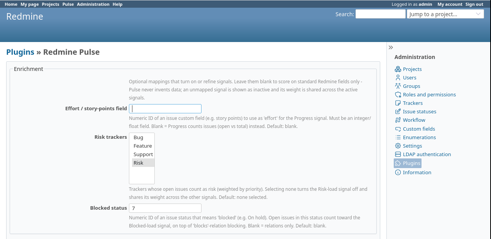
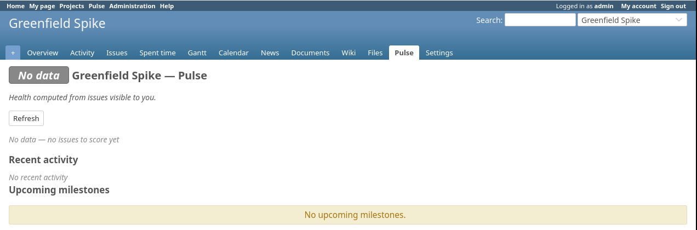

# Redmine Pulse

A portfolio and project-health dashboard for Redmine 6.1 and 7.0 — verified on 6.1.2 and
7.0.0 (plugin id `redmine_pulse`).
It answers one question — which project needs attention next, and why — by scoring every
project you can see, ranking them, and showing a red/amber/green status with the main reason
for each. English and Dutch.

[](https://github.com/pljeroen/redmine_pulse/actions/workflows/ci.yml)
[](LICENSE)
[](https://www.ruby-lang.org/)
[](https://www.redmine.org/)
[](#how-it-works)

## What it does

Redmine tracks individual issues well, but it has no built-in portfolio view — no single
place that shows which of many projects is slipping and why. Pulse adds one. It scores each
project on a handful of health signals, ranks them, colours them red/amber/green, and names
the biggest concern for each. The other plugins that do this are commercial (EasyRedmine,
RedmineUP) or unmaintained; Pulse is a free GPL alternative.

Pulse reads your Redmine data and doesn't write to it. Its own storage is a few small tables
of its own, all created by reversible migrations. You only ever see projects and issues your
Redmine account can already see.

## Screenshots

| Portfolio overview | Per-project health panel |
| --- | --- |
|  |  |

| Settings | No-data state |
| --- | --- |
|  |  |

## What it touches

- **Your Redmine data: read-only.** Pulse reads issues, versions and changesets to compute
  scores. It never creates, updates or deletes a Redmine record.
- **A few tables of its own.** The migrations create plugin-prefixed tables — `pulse_snapshots`
  (the score cache), `pulse_views` (saved views) and `pulse_alert_states` (alert bookkeeping).
  They don't collide with any core table, and every migration reverses, so uninstalling drops
  them cleanly. Your saved configuration lives in one row of Redmine's core `settings` table;
  [Uninstall](#uninstall) has the optional step to clear it.
- **A page-head hook** for the project-list RAG badges. It runs on every page but returns
  immediately on anything other than the project index, and is wrapped so a failure inside
  Pulse can't break the page around it.
- **Email — only if you set up alerts.** The alert scan (a rake task you schedule; see
  [Alerts](#alerts-and-webhooks)) emails users who have opted in to watch a project's health.
  Nothing is sent until you schedule it and someone subscribes.
- **Outbound HTTP — only to endpoints you configure.** Webhooks are off until you add one.

## Installation

From your Redmine root:

```sh
cd plugins
git clone https://github.com/pljeroen/redmine_pulse.git redmine_pulse
cd ..
bundle install
bundle exec rake redmine:plugins:migrate RAILS_ENV=production
bundle exec rails assets:precompile RAILS_ENV=production
```

Then restart your application server (Passenger, Puma, etc.).

The `assets:precompile` step is required. Redmine 6.x and 7.0 serve plugin CSS/JS as fingerprinted
[Propshaft](https://github.com/rails/propshaft) assets; without it the stylesheet and the
project-list badge script are never served, so the dashboard renders unstyled and the badges
don't appear. Re-run it after every upgrade.

### Upgrade

```sh
cd plugins/redmine_pulse
git pull
cd ../..
bundle install
bundle exec rake redmine:plugins:migrate RAILS_ENV=production
bundle exec rails assets:precompile RAILS_ENV=production
```

Restart the application server, and check [`CHANGELOG.md`](CHANGELOG.md) for anything
version-specific.

### Uninstall

```sh
# 1. Reverse the migrations (drops Pulse's tables).
bundle exec rake redmine:plugins:migrate NAME=redmine_pulse VERSION=0 RAILS_ENV=production
# 2. Remove the plugin.
rm -rf plugins/redmine_pulse
# 3. (Optional) Delete the saved-configuration row.
RAILS_ENV=production bundle exec rails runner "Setting.where(name: 'plugin_redmine_pulse').delete_all"
```

Restart the application server. Step 1 drops Pulse's tables and indexes; step 2 removes the
plugin; step 3 clears the one row Pulse leaves in the core `settings` table (safe to run
before or after step 2). Your Redmine data is untouched — Pulse never wrote to it.

## Getting started

Pulse is a per-project module, so you turn it on where you want it and grant the read
permission to the roles that should see it:

1. **Enable the module per project.** In a project's *Settings → Modules*, tick **Pulse**.
   Do this on every project you want in the portfolio.
2. **Grant the permission.** In *Administration → Roles and permissions*, grant **View pulse**
   (`view_pulse`) to each role that should use the dashboard.
3. Open **`/pulse`** for the portfolio, or the **Pulse** tab on any enabled project for its
   panel. The panel links to Redmine's built-in **Gantt** when you have `view_gantt`.

A fresh install shows an empty portfolio and no badges until you enable the module on at least
one project — that's expected. Pulse only surfaces projects whose module is on and that you're
allowed to see.

## Scoring

Each project is scored on signals, each normalised to 0–1:

- **Staleness** — time since meaningful activity.
- **Progress** — how much of the work is done (by issue count, or by effort if an effort field
  is mapped).
- **Momentum** — the trend of activity over the activity window.
- **Risk load** — open issues in the configured risk trackers.
- **Blocked load** — issues blocked by visible blockers.
- **Planning coverage** — optional, off by default: how well open issues are planned (estimate,
  assignee, due date).

The signals combine into a 0–100 score using the configured weights, which renormalise over
whichever signals are active, and the score maps to a red/amber/green status via two
thresholds. The same scores drive lenses that re-rank (not re-score) the portfolio — health,
at-risk, stale, done, blocked, and any named lenses you define.

Each project shows its per-signal contributions, which add back up to the score, and its worst
signal as the "main concern" (with a distinct no-data state when there's nothing to score).
The retrospective sparkline is drawn from real activity, and the forward timeline shows only
milestone dates a user actually set — Pulse doesn't invent dates.

## More features

Beyond the core dashboard, all optional and off until you turn them on:

- **Named lenses** — define your own weighted ranking and use it as a lens.
- **Per-role scoring profiles** — show different roles a differently weighted score.
- **Saved views** — store a lens and filter as a private, role-scoped, or shared view.
- **Health alerts** — a scheduled scan emails watchers when a project's status changes.
- **Outbound webhooks** — POST a signed JSON payload to your own endpoint on a status change.

### Alerts and webhooks

Alerts and webhooks run from a rake task you schedule yourself (with cron or similar) —
Pulse doesn't bundle a background worker:

```sh
bundle exec rake redmine_pulse:scan_and_alert RAILS_ENV=production
```

Users opt in per project ("Watch project health"), and an admin can auto-subscribe a role.
Recipients are checked against `view_pulse` again at send time, so revoking access stops the
alerts. Webhooks are configured per endpoint in settings, sign each payload with HMAC-SHA256,
default to HTTPS with a guard against non-public targets (both overridable per endpoint), and
send nothing until you add an endpoint with a signing secret.

## Configuration

Pulse ships with defaults and works out of the box. Tune it under *Administration → Plugins →
Redmine Pulse → Configure*:

| Setting | What it does | Default |
| --- | --- | --- |
| **Effort field** | Custom field used to weight progress by effort instead of issue count. Unset → progress uses issue counts. | _(unset)_ |
| **Risk trackers** | Trackers that count toward the risk-load signal. Unset → the signal is omitted and its weight redistributed. | _(none)_ |
| **Blocked status** | Status that marks an issue as blocked, in addition to `blocks` relations. | _(unset)_ |
| **Weights** | The relative weight of each signal. They renormalise over the active signals. | balanced |
| **RAG green / amber thresholds** | At/above green → green; at/above amber → amber; below → red. | 67 / 34 |
| **Horizons** (`h_stale`, `h_risk`, `h_blocked`) | The day/count horizons that normalise the staleness, risk and blocked signals. | 180 / 50 / 20 |
| **Activity window (days)** | The trailing window for the momentum signal and the sparkline. | 30 |
| **Momentum shape** | The activity level that reads as neutral, and how much net issue completion nudges momentum up or down. | 8 · 0.15 |
| **On-track threshold** | When a project's worst signal is at/above this (0–1), the main concern reads "On track" instead of naming a signal. | 0.5 |
| **Freshness cap (minutes)** | Refreshes a cached snapshot older than this on the next view. `0` = only recompute when the underlying data changes. | 60 |

The mappings that depend on your custom fields or trackers (effort field, risk trackers,
blocked status) are optional — leave them blank and the affected signal is omitted rather than
faked. Out-of-range values are rejected and reported, not silently saved. Each field has inline
help on the settings page.

## API

Pulse exposes the computed metrics as read-only JSON so external dashboards (Grafana and the
like) can consume them:

- `GET /pulse/portfolio.json` — a ranked array of per-project health summaries. Supports
  `?lens=<health|at_risk|stale|done|blocked>` and pagination (`?offset=&limit=`, default 100).
- `GET /pulse/projects/:id.json` — one project's full breakdown plus its history series and
  forward milestones.

The response shapes are published as JSON Schemas —
[`portfolio.json`](docs/specs/redmine-pulse/contracts/schemas/portfolio.json) and
[`project.json`](docs/specs/redmine-pulse/contracts/schemas/project.json) — with example
payloads under [`contracts/seeds/`](docs/specs/redmine-pulse/contracts/seeds/).

Authentication uses the standard Redmine REST mechanism: the admin **Enable REST web service**
setting must be on, and the request carries an API key (`X-Redmine-API-Key` header, `key`
param, or HTTP Basic). Both endpoints are authorised by `view_pulse` and scoped to the caller's
visibility, exactly like the UI.

Each payload carries a `schema_version`, two timestamps (`snapshot_computed_at` and
`projected_at`), and a `projection` block (`clock_today`, `time_zone`, `activity_window_days`,
the horizons) so a client can reconstruct the time-derived values. Response codes: **404** when
the project isn't in your visible set or doesn't exist, **403** when it's visible but you lack
permission or the module is off, and Redmine's standard 401/403 for REST-disabled requests.

New fields are added within a `schema_version` without bumping it, so write your consumer as a
tolerant reader — read the fields you need and ignore the rest. The `schema_version` bumps only
for a breaking change (a removed or renamed field, or a changed meaning).

## Compatibility

The [CI workflow](.github/workflows/ci.yml) exercises this matrix on every push to `master`
and on manual dispatch:

| Redmine | Ruby 3.2 | Ruby 3.4 |
| --- | --- | --- |
| **6.1.x** (Rails 7.2) | PostgreSQL 16 · MySQL 8 | PostgreSQL 16 · MySQL 8 |
| **7.0.x** (Rails 8.1) | PostgreSQL 16 · MySQL 8 | PostgreSQL 16 · MySQL 8 |

That's eight combinations plus a fast standalone pure-domain lane. CI runs on pushes to `master`
and manual dispatch only, never on pull requests, so a fork PR triggers nothing.

Development verifies the full suite against Redmine 6.1.2 on Ruby 3.4 + PostgreSQL 16, the
pure-domain lane on Ruby 3.2 and 3.4, and a full run on MySQL 8; CI additionally exercises
Redmine 7.0.0 (Rails 8.1) across the same matrix. Other Redmine 6.x / 7.0.x point releases
should work but aren't part of the verified set yet; the DOM and asset assumptions are kept
defensive.

The interface ships in English and Dutch (`nl`); Redmine renders it in each viewer's language
and falls back to English for anything untranslated.

## How it works

Pulse uses a hexagonal (ports and adapters) architecture. The scoring engine under
`lib/pulse/domain/` is plain Ruby with no framework dependencies — no Rails, no ActiveRecord —
so the core logic is deterministic and testable on its own. All Redmine integration (reading
issues, versions and changesets; caching; rendering) lives in adapters under
`lib/pulse/adapters/` and `app/`, behind the ports in `lib/pulse/ports/`. Expensive aggregates
are cached in a snapshot; the time-dependent part of the score is computed cheaply per request.

## Running tests

Two lanes, mirroring CI:

- **Pure-domain suite** (no database, no Rails) — the fast inner loop:

  ```sh
  ruby -Itest -Ilib -e 'Dir["test/unit/domain/*_test.rb"].sort.each { |f| require File.expand_path(f) }'
  ```

- **Full Redmine-integrated suite** — the committed harness under
  [`scripts/test-redmine/`](scripts/test-redmine/README.md), an ephemeral, isolated
  container stack parameterized over the compatibility matrix (Redmine `6.1.2`/`7.0.0` ×
  `postgres`/`mysql`). For example, Redmine 7.0 on MySQL:

  ```sh
  REDMINE_VERSION=7.0.0 DB=mysql ./scripts/test-redmine/up.sh
  REDMINE_VERSION=7.0.0 DB=mysql ./scripts/test-redmine/run-tests.sh
  ```

  Both default to `6.1.2` / `postgres`.

[`scripts/ci/run.sh`](scripts/ci/run.sh) is what CI invokes; it runs both lanes against any
prepared Redmine checkout (set `REDMINE_ROOT` or pass the root as `$1`).

## Roadmap

More locales, and wider coverage of Redmine 6.x / 7.x point releases. See [`CHANGELOG.md`](CHANGELOG.md).

## Contributing

This is a personal project and I'm not taking outside contributions right now, so issues and
pull requests won't be reviewed or merged for the time being (that may change later). You're
welcome to fork it under the GPL and adapt it to your own needs.

## License

GPL-2.0-only, to match Redmine. See [`LICENSE`](LICENSE).
